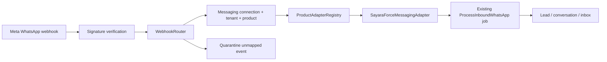
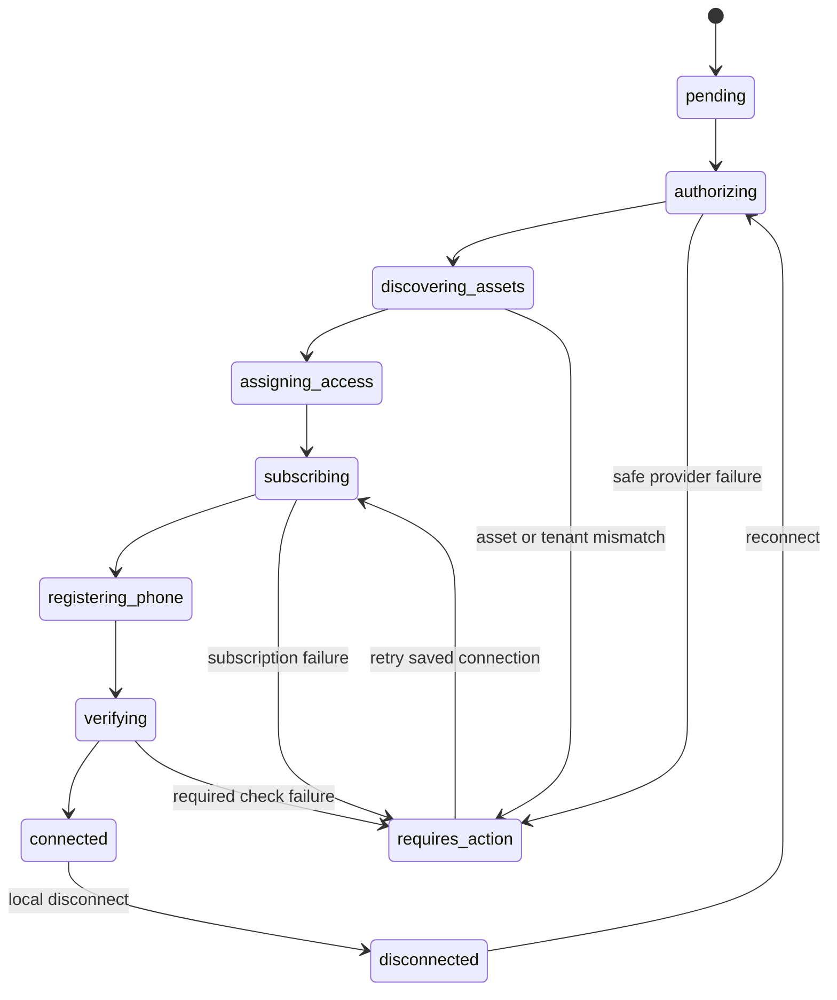

# SayaraForce self-service WhatsApp onboarding — Phase 1

## Executive result

Phase 1 adds an in-application, tenant-scoped Meta Embedded Signup flow without creating a separate integrator service and without replacing the working Smart Matrix path. New connections use a product-neutral messaging core. SayaraForce-specific lead, conversation and inbox behaviour remains behind a product adapter and continues through the existing `ProcessInboundWhatsApp` job.

This implementation was developed and tested without calling live Meta APIs, changing production configuration, opening Embedded Signup with a real account, or changing the existing Smart Matrix connection.

## Baseline and current-state audit

Baseline recorded on 5 August 2026:

- Repository: `C:\laragon\www\garagecrm`
- Branch: `main`
- Starting HEAD: `0a27ab087d7bb5e0d06bf325a7c1f59a28826ca5`
- Framework: Laravel 12.38.1 (the task described Laravel 13; Composer currently requires Laravel `^12.0`)
- PHP: 8.3.16
- Node: 20.19.6
- Routes before Phase 1: 426
- Baseline WhatsApp tests: 38 tests, 231 assertions, passed
- Baseline full suite: 171 tests, 1,092 assertions, passed

The repository already contained unrelated uncommitted public-enquiry, Meta Pixel, booking and build-output work. Those changes were preserved. Phase 1 did not reset, clean, stage, commit, push or deploy the repository.

### Existing implementation found

| Area | Existing path | Finding |
|---|---|---|
| Admin onboarding | `Admin\WhatsAppEmbeddedSignupController` | Working tenant-specific v4 Embedded Signup with separate Business App and Cloud API configurations. Viewing the legacy page creates a session immediately. |
| Provisioning | `Services\WhatsApp\MetaEmbeddedSignupService` | Server-side code exchange, token inspection, WABA/phone validation, WABA subscription, nested subscription read-back and coexistence validation. Tightly coupled to `Company`. |
| Token storage | `companies.meta_access_token` | Encrypted by onboarding service. Legacy model/driver also permit plaintext fallback if decryption fails; Phase 1 does not copy this behaviour. |
| Tenant mapping | Company WABA and phone columns | Exact provider-ID mapping with ambiguity rejection. No phone-string tenant guessing. |
| Webhook security | `Webhooks\MetaWhatsAppWebhookController` | Global or unique tenant verification token for GET; mandatory `X-Hub-Signature-256` validation for POST. |
| Webhook durability | `whatsapp_webhook_events` | Encrypted payloads, event-key deduplication, queued inbound/coexistence processing. |
| Inbound CRM handling | `ProcessInboundWhatsApp` | Tenant-bound lead resolution, opportunity/client creation, conversation/message storage and existing automation. |
| Coexistence | `MetaCoexistenceWebhookService` | Contact sync, history isolation, mobile-app echoes, idempotency and no history-triggered automation. |
| Outbound | `Drivers\MetaCloudWhatsApp` | Sends using company-scoped phone ID and token. New connected records are mirrored into these fields only after mandatory checks pass. |
| UI | `admin/whatsapp/connect.blade.php` | Existing coexistence diagnostics and legacy onboarding remain intact. |
| Registration | `RegisteredUserController` | Routes existed but both actions returned 404, so a new garage could not self-onboard. |
| Super admin | Existing platform routes | No neutral connection/health/provisioning view existed. |

### Root risks identified

1. Company-specific credential fields combined reusable provider concerns with SayaraForce tenancy.
2. The legacy driver accepts a plaintext credential when decryption fails. New messaging credentials now fail closed; changing the legacy fallback is deferred until legacy records are audited.
3. Embedded Signup completion previously wrote directly to Company fields and could describe a connection as active while subscription verification was pending.
4. There was no persisted per-check health model, consent record, neutral audit history or safe quarantine for unknown provider assets.
5. Garage registration was intentionally disabled.
6. Garage-specific lead/message operations lived directly behind the provider webhook rather than a product adapter boundary.

## Architecture

The additive core is under `App\Messaging`. It contains neutral models, data objects, exceptions and Meta-specific provider services. The SayaraForce adapter is under `App\SayaraForce\Messaging`.



The generic core does not reference garages, mechanics, jobs, vehicle services or bookings. The product key is initially `sayaraforce`; the schema and registry allow a future adapter such as `property_broker_ai`.

### Main services

- `MetaApiClient`: server-only Graph API requests and sanitized provider failures.
- `OnboardingStateService`: HMAC-signed, expiring, user/tenant/product-bound state plus a separate nonce; only hashes are stored.
- `EmbeddedSignupService`: configuration separation, session creation and versioned consent.
- `ProvisioningService`: idempotent state machine, asset discovery, tenant validation, subscription, verification, recovery and legacy synchronization.
- `SubscriptionService`: POST subscription and bounded read-back using `data[*].whatsapp_business_api_data.id`, with top-level ID retained only as compatibility.
- `PhoneRegistrationService`: verifies the registration result returned by Embedded Signup. Phase 1 does not collect or persist an OTP or PIN.
- `ConnectionHealthService`: persists each health result independently.
- `WebhookRouter`: resolves exact provider asset IDs, supports legacy Company mapping, rejects ambiguity and quarantines unknown events.
- `TokenService`: encrypted model storage and fail-closed decryption.
- `DisconnectService`: local-only, permission-checked disconnect that preserves CRM history and external Meta assets.
- `LegacyCompanyConnectionSynchronizer`: mirrors a verified new connection into the current Company fields needed by the operational inbox/outbound driver; rejects conflicting assets.

## User journey

1. A garage owner registers with garage name, contact details and password.
2. Registration creates one Company and one active admin in a database transaction, signs the user in and opens the self-service WhatsApp screen.
3. The owner selects an existing Business App number or a dedicated number.
4. The owner accepts the explicit messaging consent.
5. SayaraForce creates a signed, expiring tenant/user/product state and nonce only after the click.
6. The browser opens the appropriate Meta configuration.
7. Meta returns a temporary authorization code and session information.
8. The browser sends those temporary values to Laravel over the authenticated CSRF-protected endpoint.
9. Laravel validates the state, nonce, expiry, user, tenant, product and expected completion event.
10. Laravel exchanges the code, discovers and validates Meta assets, subscribes the app, verifies the nested read-back and runs persisted health checks.
11. Only after mandatory checks pass is the connection marked `connected` and mirrored into the current SayaraForce operational fields.
12. The owner sees status/checks and can open the existing inbox.

```mermaid
sequenceDiagram
    actor Owner
    participant Browser
    participant SF as SayaraForce
    participant Meta
    participant DB

    Owner->>Browser: Select mode and accept consent
    Browser->>SF: POST onboarding/session
    SF->>DB: Store hashed state/nonce + consent
    SF-->>Browser: Signed state, nonce, Meta configuration
    Browser->>Meta: Embedded Signup (response_type=code)
    Meta-->>Browser: Temporary code + session information
    Browser->>SF: POST onboarding/complete
    SF->>SF: Validate auth, tenant, state, nonce, expiry and mode
    SF->>Meta: Exchange temporary code server-side
    SF->>Meta: Inspect token and discover WABA/phone/business
    SF->>DB: Upsert neutral connection and phone
    SF->>Meta: POST WABA subscribed_apps
    SF->>Meta: GET WABA subscribed_apps
    SF->>Meta: Run required health reads
    SF->>DB: Persist checks; mark connected only if mandatory checks pass
    SF-->>Browser: Connected or actionable recovery state
```

## Provisioning state machine



`failed` is available for terminal local failures. Provider/recoverable failures retain validated assets and encrypted authorization as `requires_action`, allowing an idempotent retry without duplicating records.

## Data model

| Table | Purpose |
|---|---|
| `messaging_connections` | One tenant/product/provider connection, provisioning state, WABA/business IDs, encrypted token and safe failure state. |
| `messaging_phone_numbers` | Provider phone assets, registration/coexistence/quality metadata and primary mapping. |
| `messaging_onboarding_sessions` | Hashed state and nonce, tenant/user/product binding, expiry, replay state and attempts. No authorization code or token. |
| `messaging_consents` | Version, actor, time, tenant, connection/session and enabled capabilities. |
| `messaging_connection_checks` | Individual durable checks and sanitized failure code. |
| `messaging_audit_logs` | Connection lifecycle actions, safe identifiers, result and attempt number. |
| `messaging_webhook_events` | Payload hash and minimal shape for neutral routing/quarantine; raw message content is not stored here. |

Phase 1 deliberately reuses current SayaraForce conversations, message logs and CRM records instead of creating parallel operational message tables.

## Security controls

- Server-only token exchange; app secret and access token are not rendered to HTML or JavaScript.
- Encrypted access-token cast with fail-closed retrieval.
- Signed and expiring state, separate nonce, hashed persistence and replay status.
- State claims bind company, user and product; callbacks are additionally authenticated and CSRF protected.
- Admin-only tenant routes and super-admin-only platform diagnostics.
- Browser-supplied WABA, business and phone IDs must match provider discovery and ownership reads.
- Unique provider WABA and phone mappings prevent cross-tenant claims.
- No fallback to phone-string tenant resolution.
- Mandatory webhook signature verification remains unchanged.
- Unknown provider assets are quarantined with a payload hash and shape only.
- Audit contexts recursively redact credential, code, PIN, message-body and phone-like keys.
- User-facing failures are safe and provider HTTP details stay out of the customer UI.
- Disconnect is local-only, requires explicit acknowledgement and never deletes external Meta assets.
- All automated tests use Laravel HTTP fakes; no live Meta writes occur.

## Health checks

Mandatory checks before activation:

- encrypted authorization can be decrypted;
- token is valid for the expected Meta App and contains required scopes;
- WABA is accessible;
- expected app is present in WABA subscription read-back;
- phone is accessible and registration is ready;
- required webhook fields are enabled;
- provider assets resolve to exactly one tenant;
- signed webhook route is present.

Advisory checks record coexistence, last inbound and first outbound status. The UI displays each check independently rather than reducing the connection to an unexplained boolean.

## Coexistence handling

The existing-number option uses its dedicated configuration with:

- `response_type: code`
- `override_default_response_type: true`
- `featureType: whatsapp_business_app_onboarding`
- Embedded Signup v4
- `sessionInfoVersion: 3`

The completion event must be `FINISH_WHATSAPP_BUSINESS_APP_ONBOARDING`, and provider phone data must confirm `is_on_biz_app`. Standard `FINISH` events are rejected for this path. The Cloud API option uses a separate configuration and rejects a Business App phone result.

Existing contact/history sync and mobile-app echo handling remains in the proven coexistence services.

## Failure recovery

| Failure | Behaviour |
|---|---|
| Popup cancel/error | No callback activation; UI explains no connection was saved. |
| State/nonce mismatch or expiry | Rejected before any Meta request. |
| Code expiry or missing permission | Session receives a safe failure code; restart Embedded Signup. |
| WABA/business/phone mismatch | Rejected; no user-controlled binding. |
| Phone claimed by another tenant | Rejected before persistence. |
| Subscription/read-back delay | Bounded retry; retain `requires_action` and retry saved provisioning. |
| Registration/display-name/business review pending | Persist actionable health failure; do not mark connected. |
| Rate limit/outage | Sanitized provider classification; retry remains idempotent. |
| Token expiry | Start reconnect to obtain fresh authorization. |
| Disconnect | Stop local outbound activity, revoke local consent and preserve CRM/external Meta history. |

## Smart Matrix regression evidence

The legacy Company-backed route remains available. Webhook routing first checks the new neutral provider mapping, then performs the prior exact active-Company lookup. It rejects zero or multiple matches and verifies WABA compatibility.

Automated regression proves that a Smart Matrix-style legacy fixture:

- retains the same WABA, phone mapping and stored token value;
- receives an inbound event exactly once through the existing job;
- does not create a neutral duplicate connection;
- keeps the corrected nested subscription parser;
- does not invoke any disconnect or production Meta write.

The existing coexistence and Embedded Signup suites remain part of the completion gate.

## Operational runbook

1. Apply the Phase 1 migration in a controlled release after a database backup.
2. Confirm both Meta Embedded Signup configuration IDs are distinct.
3. Confirm app ID/secret, Graph version, callback URL and global verification token are configured through the deployment environment.
4. Confirm `messages`, `smb_app_state_sync` and `smb_message_echoes` fields are enabled for `whatsapp_business_account`.
5. Start/reload queue workers after release.
6. Create a test tenant; do not use Smart Matrix for the first test.
7. Complete a dedicated-number sandbox/mock UAT, then an eligible Business App coexistence UAT.
8. Confirm the neutral connection and phone each have exactly one tenant mapping.
9. Confirm the app subscription check uses `whatsapp_business_api_data.id` and shows passed.
10. Send one external inbound message and confirm one inbox message/lead for the test tenant.
11. Send one staff reply and confirm delivery through the selected number.
12. Test retry, token expiry messaging and local disconnect without deleting Meta assets.
13. Inspect audit/check records; never copy credential columns into diagnostics.

## Required environment configuration

Phase 1 reads these deployment values. Do not copy a local `.env` to production.

- `MESSAGING_PRODUCT_KEY=sayaraforce` (optional default)
- `META_APP_ID`
- `META_APP_SECRET`
- `META_GRAPH_BASE` (optional)
- `META_GRAPH_API_VERSION`
- `META_WHATSAPP_BUSINESS_APP_CONFIG_ID`
- `META_WHATSAPP_CLOUD_API_CONFIG_ID` (or existing standard Embedded Signup configuration fallback)
- `META_WHATSAPP_SYSTEM_USER_ID` (optional; required only when the Meta commercial setup requires platform system-user assignment)
- `META_WHATSAPP_SYSTEM_USER_ACCESS_TOKEN` (optional deployment secret; never browser-exposed)
- `META_WHATSAPP_EMBEDDED_SIGNUP_VERSION=v4`
- `META_WHATSAPP_SESSION_INFO_VERSION=3`
- `META_WHATSAPP_SIGNUP_SESSION_TTL=15`
- existing global WhatsApp webhook verification token
- HTTPS application/callback base URL

No token, authorization code, OTP or two-step-verification PIN belongs in source control.

## Meta dashboard configuration still required

- Keep the Meta App live with Advanced Access for `whatsapp_business_management` and `whatsapp_business_messaging`.
- Maintain two distinct Embedded Signup configurations: Business App onboarding and standard Cloud API.
- Configure allowed domains, valid OAuth redirect/callback domains and HTTPS.
- Configure and verify the WhatsApp webhook callback.
- Enable required `whatsapp_business_account` webhook fields.
- Ensure the Tech Provider/system-user/credit-line model required for the chosen commercial setup is configured externally. Phase 1 validates tenant-granted access but does not invent or assign an unconfigured system user.

Meta's official Embedded Signup collection documents the required provider endpoints, including WABA user access, phone registration and `POST /{WABA-ID}/subscribed_apps`: <https://www.postman.com/meta/whatsapp-business-platform/documentation/du6gzjv/embedded-signup>.

## Final testing evidence

- New self-service onboarding suite: 20 tests, 118 assertions, passed.
- All WhatsApp-focused suites: 58 tests, 349 assertions, passed.
- Registration suite: 3 tests, 10 assertions, passed.
- Complete application suite: 192 tests, 1,217 assertions, passed.
- Production Vite build: passed with the existing non-blocking Browserslist, runtime font-resolution and large-chunk warnings.
- PHP syntax: 47 Phase 1 implementation files passed `php -l`.
- Blade compilation: `view:clear` and `view:cache` passed.
- Route inventory after Phase 1: 435 routes; all owner, callback, health, retry, disconnect and super-admin diagnostic routes registered.
- Diff integrity: `git diff --check` passed; only line-ending notices on pre-existing working-tree files were reported.
- Every Meta request in automated tests was intercepted with Laravel HTTP fakes. No live provider write was performed.

## Known limitations

1. The application is Laravel 12.38.1, not Laravel 13.
2. Existing production credentials remain in legacy Company columns; neutral records are created only by new self-service flows. A backfill should be separately reviewed before migrating Smart Matrix.
3. The legacy outbound driver still contains plaintext fallback for historical compatibility. The new TokenService does not. Remove the fallback only after auditing/migrating legacy credentials.
4. Phase 1 relies on Embedded Signup to perform OTP/two-step verification and phone registration. It verifies the result but does not collect a PIN or call a separate `/register` endpoint.
5. System-user assignment and credit-line sharing vary by Meta commercial configuration and remain an external prerequisite where required.
6. Generic conversations/messages/templates/automation tables are not introduced yet; SayaraForce reuses the existing operational tables through its adapter.
7. Quarantined neutral webhook records intentionally retain only a hash and payload shape. Encrypted raw receipts remain in the existing mapped-event table.
8. No browser screenshots or live Meta UAT were produced because this task prohibited deployment and real onboarding.

## Recommended Phase 2

1. Add an encrypted, provider-neutral outbound command/job that uses `MessagingConnection` directly, then switch SayaraForce outbound through the adapter after regression testing.
2. Backfill legacy connections in dry-run mode, compare exact tenant/WABA/phone mappings and migrate Smart Matrix only with explicit production approval.
3. Add a provider-neutral encrypted raw webhook vault with retention controls, then move the full webhook controller behind the core router.
4. Extend the configured system-user assignment step with commercial credit-line sharing and provider read-back where the selected Meta model requires it.
5. Add template, consent/opt-out and usage/billing abstractions.
6. Extract `App\Messaging` into a shared package or gateway only after a second product validates the contracts.

## Manual verification checklist

- [ ] New registration creates one company and one admin, then opens WhatsApp onboarding.
- [ ] Owner page contains no access token, app secret or Graph API jargon.
- [ ] Consent must be accepted before Meta opens.
- [ ] Existing-number and dedicated-number buttons use distinct configuration IDs.
- [ ] Cancel leaves no active connection.
- [ ] Success is not shown until subscription and mandatory checks pass.
- [ ] Exactly one connection and phone record exist after callback retry.
- [ ] Connected number opens the existing inbox.
- [ ] External inbound message appears once in the correct tenant.
- [ ] Staff reply is sent through the connected number.
- [ ] Super-admin diagnostics show checks/audits but no credential.
- [ ] Reconnect and retry do not duplicate assets.
- [ ] Disconnect stops outbound activity, preserves CRM history and leaves Meta assets intact.
- [ ] Smart Matrix mapping and inbound/outbound behaviour remain unchanged.
