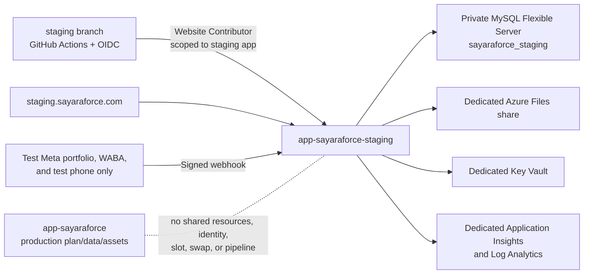

# SayaraForce staging environment

## Status and safety boundary

This runbook defines a permanent, production-isolated staging environment for SayaraForce. Azure and the production MySQL structure have now been independently audited through read-only paths. The verified production app is `app-sayaraforce` in `rg-garagecrm-prod`, UAE North, and the verified database service is MySQL Flexible Server 8.0. No Azure resource, DNS record, Meta asset, callback, application setting, certificate, deployment, restart, migration, slot, production view, or production application was changed during that audit.

Azure staging remains unprovisioned. `provision-staging.ps1` still performs an independent read-only confirmation and stops before any write when the subscription, production resource group, exact production app, or region is ambiguous.

Never use this runbook to alter `app-sayaraforce`. Never create a deployment slot or swap. Never load Smart Matrix credentials or assets into staging.

## Architecture



Staging uses a separate resource group, App Service Plan, Web App, database server/database, VNet, storage account/share, Key Vault, logging workspace, Application Insights instance, credentials, settings, and deployment identity. Queue, cache, and sessions are database-backed but live only in the isolated staging database and use staging-specific prefixes/cookie names. This matches the repository's current database queue/cache technology without sharing a production backend.

The staging package injects staging-only continuous queue and scheduler WebJobs at package time. Both workers check `APP_ENV=staging` and `WEBSITE_SITE_NAME=app-sayaraforce-staging` before they can run. The generic/production queue worker and legacy scheduler package are excluded from the staging artifact; staging worker sources stay under `ops/` so a normal production source package does not register them.

## Prepared resource inventory

| Resource | Prepared name | Isolation |
|---|---|---|
| Resource group | `rg-sayaraforce-staging` | Staging only |
| App Service Plan | `plan-sayaraforce-staging` | Separate B1 Linux plan |
| Web App | `app-sayaraforce-staging` | PHP 8.3, HTTPS only, no slots |
| MySQL Flexible Server | `mysql-sayaraforce-staging-<unique>` | Private VNet access, no production permissions |
| Database | `sayaraforce_staging` | Staging server only |
| VNet | `vnet-sayaraforce-staging` | Separate app and MySQL subnets |
| Storage | `stsayaraforcestaging` or close available staging name | Dedicated Azure Files share |
| Key Vault | `kvsfstaging<unique>` | Staging secrets only, purge protection |
| Logs | `log-sayaraforce-staging` | Separate Log Analytics workspace |
| Monitoring | `appi-sayaraforce-staging` | Separate Application Insights instance |
| Domain | `staging.sayaraforce.com` | CNAME to the staging Azure hostname only |

Globally unique MySQL, storage, and Key Vault names may need a short suffix. Every selected alternative must still include `staging`, and it must be recorded here before provisioning.

## Production baseline audit

Repository baseline recorded before changes:

- Branch: `main`
- HEAD: `0a27ab087d7bb5e0d06bf325a7c1f59a28826ca5`
- Production workflow: `.github/workflows/main_app-sayaraforce.yml`
- Production workflow target: `app-sayaraforce`
- Existing production workflow originally triggered automatically on pushes to `main`
- Runtime declared by the workflow: PHP 8.3
- Repository database default: MySQL
- Queue default: database
- Cache default: database (local `.env` used file cache)
- Session default: database
- Filesystem default: local
- Mail default: log (local `.env` used SMTP)
- Verified production resource group/region: `rg-garagecrm-prod`, UAE North
- Verified production App Service Plan: `ASP-rggaragecrmprod-9976`
- Verified database service: MySQL Flexible Server 8.0 family
- Verified queue split: operational `jobs`, database queue `queue_jobs`, failed queue `failed_jobs`
- Web requests use `QUEUE_CONNECTION=sync`; the existing continuous `sayaraforce-queue` WebJob explicitly runs `queue:work database`

The existing production workflow has been prepared locally as manual `workflow_dispatch` only. That change has not been pushed and therefore has not changed production.

The original working tree also contained unrelated website, public-enquiry, registration, and generated frontend work. The WhatsApp implementation was selectively committed without those paths; the unrelated work remains uncommitted.

## Database strategy and approved canonical baseline

Staging must be built from a schema-only, reviewed source plus Laravel migrations and synthetic seeders. It must never be cloned from a production connection and must never contain production messages, clients, leads, vehicles, credentials, or other personal information.

The repository now contains the reviewed canonical source at `database/schema/mysql-schema.sql`. It was derived from a strictly structure-only production audit, contains 103 base tables and two portable `SQL SECURITY INVOKER` views, and includes no application rows. The only data statement targets Laravel's `migrations` ledger. The source/local/migration/code decisions and view reconstruction are recorded in `docs/SAYARAFORCE_CANONICAL_SCHEMA.md` and the adjacent manifest/safety report.

The pending migration `2026_08_05_000001_create_messaging_core_tables` runs after the baseline and creates seven tables exactly once. Two independent fresh cycles produced 110 base tables, two valid views, two synthetic tenants, zero foreign-key violations, and identical fingerprint `379628225a4c72c4e7eb236e447c90d7dd1da592dc340a5a3ea9cf99e256c21e`.

The documented repository gate is approved: `STAGING_SCHEMA_BASELINE_APPROVED=true`. This is not a global application default: `config/staging.php` remains fail-closed when the value is absent or false, and the workflow refuses deployment in either case. The reviewed staging Bicep template now sets the value to `true` only on the newly created `app-sayaraforce-staging` resource.

The MySQL server is on a delegated private subnet. Its staging-only server administrator is the application database user in the prepared baseline; it has no production server or database permission. If a separate least-privilege application user is introduced later, create it inside the staging server and keep both credentials in the staging Key Vault only.

Backups use the MySQL staging server's seven-day automated retention. Geo-redundant backup and high availability are disabled to contain staging cost. The template allows Azure to select the compatible availability placement and free/default IOPS advertised for the chosen UAE North SKU instead of forcing an unsupported zone. Review those settings before raising the environment's recovery objective.

## Environment and secret isolation

Required identity:

```text
APP_ENV=staging
APP_DEBUG=false
APP_NAME=SayaraForce Staging
APP_URL=https://app-sayaraforce-staging.azurewebsites.net  # before custom DNS
```

The Bicep template creates independent values for `APP_KEY`, MySQL password, Meta webhook verification token, and four initial account passwords. Values are generated by `provision-staging.ps1`, passed as secure deployment parameters, stored as staging Key Vault secrets, and exposed to the app only through Key Vault references. The temporary secure parameter file is created under the operating-system temporary directory and deleted in `finally`; it is never placed in the repository.

Never put Meta app secrets, system-user tokens, WABA/phone identifiers, database credentials, publish profiles, or `.env` files in GitHub workflow YAML, Bicep parameter examples, scripts, logs, screenshots, issues, or commits.

The staging GitHub identity uses OIDC and requires only Website Contributor at the `app-sayaraforce-staging` resource scope. The Bicep deployment creates `id-sayaraforce-staging-deploy` with a federated credential restricted to the repository's `sayaraforce-staging` GitHub environment. It has no role on `app-sayaraforce`, the production resource group, a production plan, or a production subscription scope. Basic SCM/FTP publishing credentials are disabled, and no publish profile is used.

## Application staging identity

`ApplyStagingIdentity` adds `X-Robots-Tag: noindex, nofollow` to every staging response, serves a staging-only `robots.txt` that disallows all crawling, adds a staging favicon/title, and injects the persistent `STAGING ENVIRONMENT — TEST DATA ONLY` banner into authenticated HTML responses, including super-administrator pages.

The login remains required for application pages. The Meta webhook remains public and retains `X-Hub-Signature-256` verification. No staging code disables signature validation.

## External communication controls

Mail uses the `log` driver by default. A staging `MessageSending` listener cancels any message unless every recipient is in `STAGING_EMAIL_RECIPIENT_ALLOWLIST` or an approved `STAGING_EMAIL_DOMAIN_ALLOWLIST`. Keep both lists empty until UAT recipients are approved.

SMS is disabled by `STAGING_SMS_OUTBOUND_ENABLED=false`. Do not add production Twilio/SMS credentials. If SMS UAT is approved, use test credentials and the same explicit phone allowlist.

WhatsApp is disabled by `STAGING_WHATSAPP_OUTBOUND_ENABLED=false`. Enabling it still requires:

- a non-empty allowlist containing the dedicated test WABA;
- a non-empty allowlist containing the dedicated test phone-number ID;
- non-empty denylists containing every known production WABA and phone-number ID;
- a recipient phone allowlist;
- test Meta credentials only.

Provider IDs are checked before persistence, webhook tenant resolution, provisioning writes, and outbound delivery. Denylisted, unknown, or unconfigured IDs fail closed without including the identifier in the exception. Legacy `Company`/Smart Matrix resolution and legacy Embedded Signup controls are disabled in staging.

## Meta staging configuration

Do not remove or replace a production Meta callback, webhook, configuration, subscription, WABA, or phone number. If the approved Meta app permits multiple entries, add the following staging entries alongside production:

- Embedded Signup entry/return page: `https://staging.sayaraforce.com/admin/messaging/whatsapp`
- Server completion endpoint used by the staging page: `https://staging.sayaraforce.com/admin/messaging/whatsapp/onboarding/complete`
- WhatsApp webhook callback: `https://staging.sayaraforce.com/api/v1/webhooks/meta/whatsapp`
- Meta Lead webhook, only if explicitly tested: `https://staging.sayaraforce.com/api/v1/webhooks/meta/leads`
- OAuth redirect, if the Meta configuration requires one: `https://staging.sayaraforce.com/admin/messaging/whatsapp`

Create separate staging Embedded Signup configuration IDs for Business App coexistence and dedicated Cloud API flows. Store the staging app/config IDs as app settings, and store app/system-user secrets or tokens in the staging Key Vault. Use a dedicated test Business Portfolio, WABA, and phone number.

If the Meta dashboard offers only a single callback/redirect and changing it could affect production, stop. Record the exact proposed dashboard change and obtain explicit approval; do not replace the production value.

## Branch and promotion model

- Feature branches contain development work.
- `feature/self-service-whatsapp-onboarding` contains the verified Phase 1 implementation.
- `staging` is the only branch that may deploy to `app-sayaraforce-staging`.
- `main` contains production-approved code only.
- The staging workflow refuses every ref other than `refs/heads/staging`.
- Production deployment is manual, refuses non-`main` refs, and uses a separate `production` GitHub environment that must have required reviewers configured before this workflow change is promoted.
- There is no staging-to-production credential, trigger, slot, swap, or auto-swap.
- Promotion to `main` must use a reviewed pull request carrying the exact commit tested in staging.

Before promoting, record the deployed commit from the restricted super-admin health page, compare it to the pull request head, complete UAT, and require an independent production approval. Production rollback uses its existing, separately approved deployment method; staging is never swapped into production.

## Provisioning

Run only from an authenticated Azure CLI session after supplying the exact subscription, production resource group, audited production region, and staging-unique names:

```powershell
.\ops\azure\staging\provision-staging.ps1 `
  -SubscriptionId '<subscription-id>' `
  -TenantId '<tenant-id>' `
  -ProductionResourceGroup '<production-resource-group>' `
  -Location '<audited-production-region>' `
  -MySqlServerName 'mysql-sayaraforce-staging-<unique>' `
  -KeyVaultName 'kvsfstaging<unique>'
```

The first run is read-only and stops after printing the exact proposal. After review, repeat with `-ConfirmStagingProvision`. Before any write, the script verifies the exact tenant/subscription and refuses when a required Azure resource provider is not already registered. Resource-provider registration is subscription-scoped and requires separate authorization. The script also refuses an existing staging resource group by default and performs no cleanup on a partial Azure failure. After reviewing a failed staging-only deployment, `-ResumeFailedStagingProvision` permits an idempotent retry only when every existing resource ID, name, and environment tag is staging-specific.

The script uses `az webapp show` for the production identity check and retrieves only specifically named production settings needed to construct staging denylists. Those values are never displayed. It performs no production write and refuses when the current subscription differs from the explicit subscription or when the proposed region differs from the audited production app.

## Deployment process

The GitHub environment `sayaraforce-staging` needs these OIDC values:

- `AZURE_STAGING_CLIENT_ID`
- `AZURE_STAGING_TENANT_ID`
- `AZURE_STAGING_SUBSCRIPTION_ID`

The Bicep deployment creates the secretless, staging-scoped managed identity and its GitHub federated credential. Populate the three GitHub environment values from the managed identity, current tenant, and explicit subscription after provisioning. `create-staging-deployment-identity.ps1` is retained only as a reviewed fallback for environments that cannot use managed-identity federation; do not run it when the Bicep-managed identity exists.

The workflow creates an ephemeral test-only application key without printing it, validates the static baseline/cutoff, lints PHP, runs focused staging/WhatsApp tests, runs the complete suite, builds frontend assets, removes the temporary `.env`, installs optimized production Composer dependencies, packages only runtime files, verifies the exact staging Azure resource ID, records branch/commit/time, deploys only to the staging app, runs guarded staging migrations, seeds the idempotent synthetic dataset, verifies the live staging schema fingerprint and isolation checks, rebuilds Laravel caches, restarts only staging, and checks `/healthz`.

The pipeline deliberately refuses deployment until the schema baseline gate is approved. It uses a short-lived Entra token for the Kudu command and never retrieves a publish profile.

Local deployment is available through `deploy-staging.ps1`; it requires a clean `staging` branch, an explicit subscription, an exact staging resource-ID check, and `-ConfirmStagingDeployment`.

## DNS and TLS

After provisioning returns the Azure hostname, create exactly this record in the `sayaraforce.com` DNS zone:

```text
Type: CNAME
Name/Host: staging
Target/Value: app-sayaraforce-staging.azurewebsites.net
TTL: 300 (or the provider's nearest supported value)
```

Do not edit the apex, `www`, `app`, mail, verification, or any production record. After DNS resolves, run `configure-staging-domain.ps1 -ConfirmStagingDomainBinding`. It validates the CNAME, binds only `staging.sayaraforce.com` to the staging app, creates an App Service managed certificate, and binds SNI TLS. HTTPS-only, TLS 1.2 minimum, secure session cookies, trusted forwarded headers, and the staging `APP_URL` are configured separately from production.

## Seeded accounts

`StagingSyntheticSeeder` creates:

- one staging platform administrator;
- one synthetic Garage Alpha administrator;
- one synthetic Garage Alpha employee/manager;
- one synthetic Garage Beta administrator;
- two synthetic companies/garages plus synthetic clients, vehicles, leads, and conversations.

It refuses non-staging environments, incomplete schemas, and missing/short Key Vault-backed passwords. It never prints passwords. Authorized operators retrieve an initial password directly from the staging Key Vault in a private session, place it in the approved password manager, sign in, and rotate it because each seeded user has `must_change_password=true`. Do not paste a secret into a ticket, terminal transcript, report, chat, or CI log.

## Staging reset

The in-app command is:

```text
php artisan staging:reset --confirm=RESET-STAGING
```

The Azure wrapper is:

```powershell
.\ops\azure\staging\reset-staging.ps1 -SubscriptionId '<subscription-id>' -Confirmation RESET-STAGING
```

The reset refuses unless all of these are true:

- `APP_ENV=staging`;
- `APP_URL` exactly matches the approved staging host;
- the configured database name exactly matches `sayaraforce_staging`;
- the database host is remote and contains `staging`;
- the production database-host denylist is non-empty and does not contain the current host;
- the application URL is not on the production URL denylist;
- the reviewed schema baseline flag is true;
- the explicit confirmation matches.

It then runs `migrate:fresh` only against the verified staging database and seeds synthetic records. There is no production reset path.

## Observability and backup verification

Laravel logs use JSON on stderr and carry `environment=staging` context. App Service application/HTTP logs, Application Insights, Log Analytics, failed-job rows, messaging audit rows, webhook quarantine records, connection checks, and deployment marker data are staging-specific. The marker is visible only in the authenticated super-admin health page and contains environment, branch, commit, and deployment time—never secrets.

Before UAT:

1. Run `verify-staging.ps1` and retain its non-secret result.
2. Confirm MySQL backup retention is seven days and perform a staging-only restore drill to a new staging-named database.
3. Confirm failed jobs and application logs appear only in the staging destinations.
4. Confirm all log records include or are resource-scoped to `environment=staging`.
5. Confirm raw tokens, authorization codes, phone numbers, and webhook bodies are absent from logs.

## WhatsApp UAT checklist

### Flow A — Business App coexistence

- [ ] Register a new synthetic staging garage.
- [ ] Accept messaging consent.
- [ ] Start Embedded Signup from the staging messaging page.
- [ ] Select only the test Meta Business and test WhatsApp Business App number.
- [ ] Return to the staging page and complete provisioning.
- [ ] Confirm WABA subscription and health checks.
- [ ] Send an inbound message from an allowlisted test number.
- [ ] Confirm tenant routing, lead creation, and inbox creation.
- [ ] Enable staging outbound only after all asset/recipient guards are populated.
- [ ] Reply through SayaraForce and verify mobile-app echo handling.
- [ ] Disconnect locally; confirm no external Meta asset was deleted.
- [ ] Reconnect using only the test assets.

### Flow B — Dedicated Cloud API number

- [ ] Use a separate unused test number.
- [ ] Complete the dedicated Cloud API Embedded Signup configuration.
- [ ] Confirm phone readiness and WABA subscription.
- [ ] Send and receive allowlisted test messages.
- [ ] Simulate and retry a provisioning failure.
- [ ] Disconnect locally.
- [ ] Confirm external Meta assets remain present.

### Tenant isolation

- [ ] Tenant A cannot view Tenant B's connection.
- [ ] Tenant A cannot call Tenant B health, retry, or disconnect actions.
- [ ] Tenant A cannot view Tenant B conversations.
- [ ] A Tenant B webhook cannot create Tenant A records.
- [ ] Unknown provider IDs are quarantined.
- [ ] A super admin can inspect both tenants without viewing tokens.
- [ ] Production provider asset IDs fail closed in staging.

## Production protection gate

Staging is not ready until all answers are yes:

- [ ] No staging value references the production database, Redis/cache, storage, mail, logs, WABA, phone, or Smart Matrix credential.
- [ ] The staging deployment identity has no production scope.
- [ ] The staging workflow contains no production publish profile or app target.
- [ ] There is no slot or auto-swap.
- [x] The schema baseline is complete, reproducible, and data-free.
- [ ] No production application setting, deployment, restart, migration, webhook, OAuth callback, DNS record, or certificate changed.
- [ ] Meta staging configuration was added without removing production configuration.
- [ ] Outbound communication remains disabled until test assets and allowlists are approved.

## Promotion and rollback

Promote the exact staging-tested commit through a reviewed pull request into `main`. Production deployment remains a separate manual approval. Never promote by slot swap. Never grant the staging identity production access.

For a failed staging deployment, redeploy the previous known-good commit to `app-sayaraforce-staging`, run staging-only migrations that are backward compatible, and verify health. For an incompatible staging migration, restore the staging database backup or run an explicitly reviewed staging rollback. Do not use a production backup.

## Emergency shutdown

If staging sends unexpectedly or appears cross-connected:

1. Stop only `app-sayaraforce-staging`.
2. Keep production running.
3. Set staging WhatsApp/SMS outbound flags to false.
4. Revoke only staging Meta/system-user credentials and staging deployment identity sessions.
5. Preserve staging logs and messaging audit records.
6. Do not unsubscribe, delete, disconnect, deregister, or modify an asset until its staging ownership is proven.
7. If an identifier matches the production denylist, leave production untouched and escalate immediately.

## Cost implications and limitations

Recurring cost comes from a dedicated B1 Linux App Service Plan, Burstable B1ms MySQL server and storage/backups, Azure storage transactions/capacity, Log Analytics ingestion/retention, Application Insights ingestion, Key Vault operations, and outbound bandwidth. A managed App Service certificate has no separate charge. Check the current Azure pricing calculator in the audited production region before provisioning.

Known limitations:

- Azure staging resources are prepared but not created; this task intentionally stopped before provisioning.
- The two production views remain invalid and unchanged. Their separately approved repair must follow local → staging → explicit production approval.
- Production retains legacy schema objects and migration-ledger drift documented in the canonical manifest; this baseline does not delete them.
- Meta staging assets and dashboard entries require an approved human operator.
- DNS and managed TLS wait for the staging Azure hostname and CNAME propagation.
- The B1 plan and B1ms database are single-instance staging choices, not high availability.
- Database queue/cache/session isolation is complete at the server/database level but is not a dedicated Redis/Service Bus design.

## Authoritative Azure references

- [Deploy App Service using GitHub Actions and OIDC](https://learn.microsoft.com/en-us/azure/app-service/deploy-github-actions)
- [Configure PHP and Laravel on App Service](https://learn.microsoft.com/en-us/azure/app-service/configure-language-php)
- [MySQL Flexible Server private networking](https://learn.microsoft.com/en-us/azure/mysql/flexible-server/concepts-networking-vnet)
- [App Service managed identities](https://learn.microsoft.com/en-us/azure/app-service/overview-managed-identity)
- [ZIP deployment and Microsoft Entra authentication](https://learn.microsoft.com/en-us/azure/app-service/deploy-zip)
